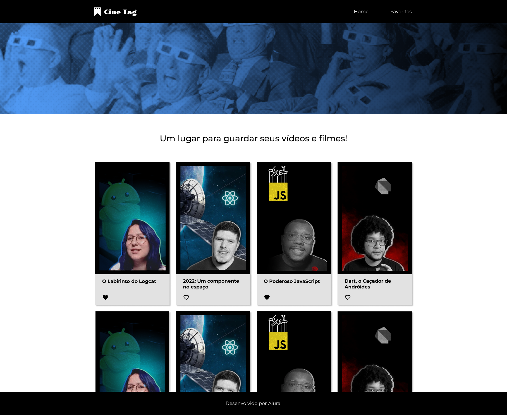

<h1> Cinetag 🍿 </h1>

O projeto CineTag foi desenvolvido com o propósito de consolidar e aplicar os conhecimentos adquiridos em diferentes áreas da programação com React.

Neste projeto, utilizou-se a biblioteca react-router-dom para explorar suas funcionalidades principais, como rotas aninhadas e dinâmicas, além de hooks importantes como useLocation, useParams, useNavigate e Outlet. Também foram integrados componentes como Link para facilitar a navegação. Além disso, o projeto incorpora funções JavaScript como map, filter, entre outras, para manipulação eficiente de dados e renderização dinâmica de componentes.

## :dizzy: Tecnologias utilizadas

  
  
  
  
  
  

## :computer: Visão Geral do Projeto

### Interface do Usuário

## :hammer: Caracteristicas

- `Página Inicial:` 

- `Página de Favoritos:` 

- `Página de Reprodução de vídeos:`

- `Página Não Encontrada:` 

## :mag: Demonstração

Para uma experiência completa e visual do projeto em funcionamento, você pode acessar a demonstração interativa do projeto, [clique aqui.](https://cinetag-gamma-lemon.vercel.app/)

## :open_file_folder: Como Utilizar

1. Clone o repositório em seu ambiente de desenvolvimento.
2. Abra o arquivo index.html em seu navegador preferido.

## :student: Autor

Este repositório contém o projeto Cinetag, desenvolvido no curso proporcionado pela Oracle em parceria com a Alura.
